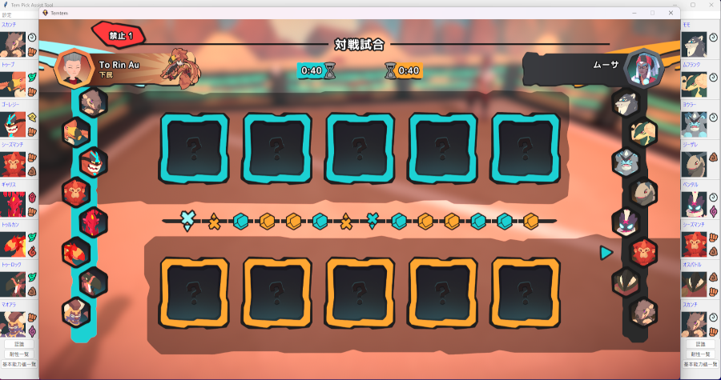
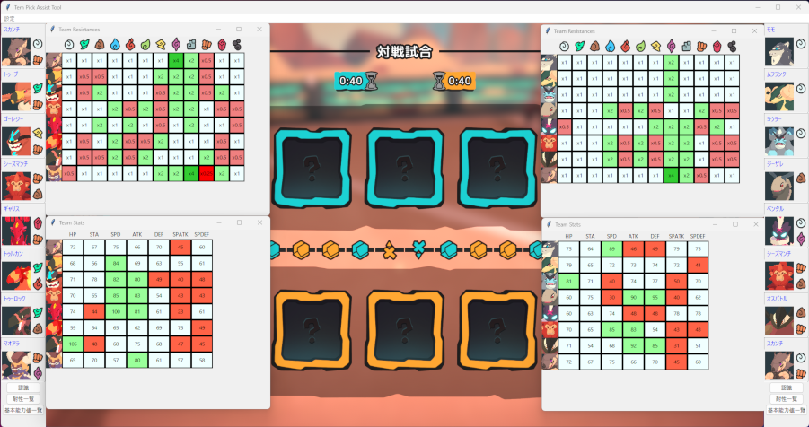

# これはなに？

Tem-Pick Assist Tool(TemPAT)。temtemのプレイをサポートするツールです。

# 何ができるの？

次のことができます

- 選出画面に映っているテムの特定とタイプの表示
- 認識されたテムのwikiを表示
- タイプ耐性一覧の表示
- 基本能力値（種族値）一覧の表示

以下スクリーンショット

↓ 認識例
 

↓ 耐性/能力値一覧の例

 

# どうやって使うの？

## 導入

1. releaseフォルダからzipファイルをダウンロードし任意の場所で解凍します。

2. 中のTem-PAT.exeを実行するとアプリが起動します。

## 使用方法

0. このソフトはtemtemの解像度設定**1600x900**にのみ対応。必ず上記解像度に設定を変更してください。

1. temtemを認識するためには2つの方法があります。どちらの場合でも、**認識** にチェックがついている側のテムが認識されます。基本的に左側は初回のみ認識し、2回目以降は自動でチェックが外れるようになっています。もし左側に再認識をかけたい場合は再度チェックをいれてください。
    1. 自動認識：メニューバーの**オプション** -> **自動検出ON**にチェックがついている場合自動で認識が走ります。認識タイミングは選出画面でカウントダウンが開始したタイミングです。自動認識ONの場合認識開始ボタンは無効化されています。  
    2. temtemゲーム内で選出画面のときに**開始**ボタンをクリックすると自分/相手のテムが認識されます。

2. 認識が完了している状態で**耐性一覧**, **基礎能力一覧**をクリックすると別ウィンドウでそれらが表示されます

3. 認識が完了している状態でテムの名前をクリックすると、ウェブブラウザでそのテムのWikiが開きます。日本語版のDBが開くか公式wikiが開くかは設定から変更できます。  

4. 認識が完了している状態でテムの顔画像をクリックするとそのテムの認識をやり直し、正解候補が5種類提示されます。そのテムから選択し反映を押すことでメインウィンドウに表示されている認識結果が変わります。

## うまく動かない場合

- 認識がうまくいっていない

    - lumaやクロメオン、コイシュに対する認識はうまくいかない場合があります

    - 選出画面に遷移してから操作可能になるまでの期間は認識がうまくいかないことがあります。操作可能になってから認識ボタンを押すことをオススメします。

    - また、環境によってはテムテムの検出位置がずれている可能性があります。メニューバーの調整機能からこれを調整できます。また**検出枠出力**にチェックを入れるとmain.exeと同じフォルダにdump_region.pngというファイルが生成されます。TemPATがどこを検出しているかが白い枠で表示されているので、もしそれがテムからずれている場合、正しい位置になるようピクセル数を調整してください。

- セキュリティソフトにひっかかる

    - Pythonコードから実行可能ファイルへの変換にnuitkaというライブラリを使用しているのですが、セキュリティソフトがウイルスと誤検知することがあるようです。今のところ有償版を使う以外に回避方法を見つけられていない状態です。（もしかしたら調査が足りないだけかもしれないですが）
    - セキュリティ対象から除外することで問題なく動くことが確認できていますが、**自己責任**でお願いします。
    - こちらのリンク https://support.microsoft.com/ja-jp/windows/windows-%E3%82%BB%E3%82%AD%E3%83%A5%E3%83%AA%E3%83%86%E3%82%A3%E3%81%AB%E9%99%A4%E5%A4%96%E3%82%92%E8%BF%BD%E5%8A%A0%E3%81%99%E3%82%8B-811816c0-4dfd-af4a-47e4-c301afe13b26 が参考になるかもしれません

- アプリが変な場所に表示される
    - 「temtem」という名前の別ウィンドウが開いていると、そちらにアプリが追随する可能性があります。特にエクスプローラーで「temtem」というフォルダを開いている場合この現象が発生しやすいです。（Chromeで公式wikiを開くぶんには問題ないことは確認済み。他ブラウザは未検証）
        - なのでできればtemtemという名前の別ファイル、ウィンドウは閉じて使用してください

    - もしTem-PATとtemtemとの間に微妙な（～数十ピクセル）ズレがある場合、手動で調整できます。オプション⇒設定から微調整してください。

# リリース履歴

| バージョン名 | 説明 | リリース日 |
| :----: | :---- | :----: | 
| [v1.2.1](https://github.com/sdba1708/tem_pat/blob/release_v1.2.1/release/v1.2.1.zip) | 下記更新<ul><li>認識結果の修正機能を追加しましました</li><li>テムの顔をクリックすると背景色が変わる機能を追加しました</li></ul> | 2023/7/10 | 
| [v1.2](https://github.com/sdba1708/tem_pat/blob/release_v1.2/release/v1.2.zip) | 下記更新<ul><li>自動認識機能を追加しました</li><li>認識ボタン周りのレイアウトを変更しました</li></ul> | 2023/7/5 | 
| [v1.1.1](https://github.com/sdba1708/tem_pat/blob/release_v1.1.1/release/v1.1.1.zip) | 下記更新<ul><li>耐性/能力値窓のサイズも保持するようにしました</li><li>表示位置を微修正できるようにオプションを追加しました</li></ul> | 2023/7/2 | 
| [v1.1](https://github.com/sdba1708/tem_pat/blob/release_v1.1/release/v1.1.zip) | 下記更新<ul><li>アプリにアイコンを追加しました</li><li>実行可能ファイル名をTem-PAT.exeとしました</li><li>名前クリックで飛べるリンクを公式wikiと日本語データベースとで切り替えられるようにしました。またデフォルトを日本語DBに設定しました。これはメニューバーのオプション⇒設定から変更できます </li><li>耐性/能力値ウィンドウの表示位置を変えたあと、再度ウィンドウを開きなおすと同じ位置に表示されるようにしました</li><li>同一のウィンドウが複数開かないようにしました</li><li>テムの画像がクリックできるようになりました。これは次回以降のアップデートに関わる変更で、今のところクリックしても何も起こりません</li></ul> | 2023/7/1 | 
| [v1.0](https://github.com/sdba1708/tem_pat/blob/release_v1.0/release/v1.0.zip) | 初版 | 2023/6/18 |

# 連絡先 

Twitter : [tonpei_torin](https://twitter.com/tonpei_torin)

# ポリシー

 この 作品 は <a rel="license" href="http://creativecommons.org/licenses/by-nc-sa/4.0/">クリエイティブ・コモンズ 表示 - 非営利 - 継承 4.0 国際 ライセンス</a>の下に提供されています。

本アプリケーションで表示している画像、データ等の権利の全てはCREMA社に属します。
